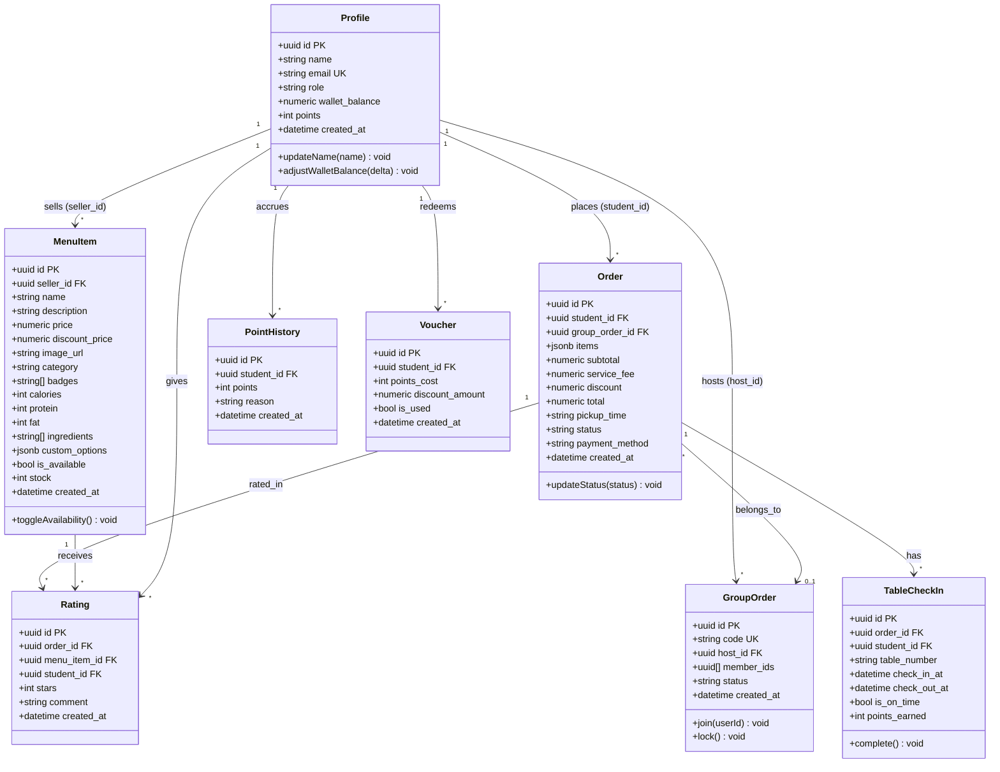

# Data Model

Document Version: v1.0

Project: DigiCanteen

Product: Aplikasi Pemesanan & Pembayaran Kantin Sekolah Berbasis Web

Status: As-Built (diturunkan dari `lib/types.ts` dan `lib/data/*.ts`)

Last Updated: 2026-07-11

Author: System Analyst AI

Source: Derived from SRS v1.0 (SoT-1) dan kode data-layer aktual (`lib/data/menu.ts`, `orders.ts`, `groups.ts`, `checkins.ts`, `points.ts`, `ratings.ts`, `lib/auth/session.tsx`)

---

## 1. Overview

Dokumen ini mendefinisikan model data DigiCanteen sebagaimana diimplementasikan di Supabase (PostgreSQL). Setiap tabel di bawah sudah dipetakan langsung dari fungsi query nyata di `lib/data/*.ts` (kolom `snake_case` di database, dipetakan ke tipe `camelCase` di `lib/types.ts` lewat fungsi `mapRow`).

---

## 2. Class Diagram



---

## 3. Entity Descriptions

### 3.1 profiles

Akun pengguna (siswa/penjual), terhubung 1:1 dengan `auth.users` bawaan Supabase Auth. Dibaca/ditulis lewat `lib/auth/session.tsx`.

| Attribute | Type | Constraint | Description |
| --- | --- | --- | --- |
| id | UUID | PRIMARY KEY, FK → auth.users.id | Sama dengan ID pengguna Supabase Auth |
| name | TEXT | NOT NULL | Nama tampilan |
| email | TEXT | UNIQUE, NOT NULL | Email login |
| role | TEXT | NOT NULL, CHECK (role IN ('siswa','penjual')) | Peran pengguna |
| wallet_balance | NUMERIC(12,2) | NOT NULL, DEFAULT 0 | Saldo dompet internal (Rupiah) |
| points | INT | NOT NULL, DEFAULT 0 | Poin akumulatif dari check-out tepat waktu |
| created_at | TIMESTAMPTZ | NOT NULL, DEFAULT NOW() | Waktu pendaftaran |

### 3.2 menu_items

Katalog menu milik seorang penjual. Dikelola lewat `lib/data/menu.ts`.

| Attribute | Type | Constraint | Description |
| --- | --- | --- | --- |
| id | UUID | PRIMARY KEY, DEFAULT gen_random_uuid() | ID menu |
| seller_id | UUID | FK → profiles.id, NOT NULL | Pemilik menu |
| name | TEXT | NOT NULL | Nama menu |
| description | TEXT | NOT NULL | Deskripsi |
| price | NUMERIC(12,2) | NOT NULL, CHECK (price >= 0) | Harga jual |
| discount_price | NUMERIC(12,2) | NULLABLE | Harga diskon opsional |
| image_url | TEXT | NOT NULL | URL foto (Supabase Storage bucket `menu-images`) |
| category | TEXT | NOT NULL, CHECK (category IN ('breakfast','lunch','snacks','drinks')) | Kategori menu |
| badges | TEXT[] | DEFAULT '{}' | Badge seperti `best-seller`, `healthy-choice`, dll. |
| calories | INT | NOT NULL | Kalori |
| protein | INT | NULLABLE | Protein (gram) |
| fat | INT | NULLABLE | Lemak (gram) |
| ingredients | TEXT[] | DEFAULT '{}' | Daftar bahan |
| custom_options | JSONB | DEFAULT '[]' | Opsi kustomisasi berbayar `{id,label,extraPrice}[]` |
| is_available | BOOLEAN | NOT NULL, DEFAULT true | Status tersedia/habis |
| stock | INT | NOT NULL, CHECK (stock >= 0) | Sisa stok |
| created_at | TIMESTAMPTZ | NOT NULL, DEFAULT NOW() | Waktu dibuat |

### 3.3 orders

Header pesanan siswa. Dibuat saat checkout (`lib/data/orders.ts`), status berubah sepanjang alur pemrosesan.

| Attribute | Type | Constraint | Description |
| --- | --- | --- | --- |
| id | UUID | PRIMARY KEY, DEFAULT gen_random_uuid() | ID pesanan |
| student_id | UUID | FK → profiles.id, NOT NULL | Siswa pemesan |
| group_order_id | UUID | FK → group_orders.id, NULLABLE | Terkait Group Order (opsional) |
| items | JSONB | NOT NULL | Array `{menuItemId, quantity, note?, selectedOptions[]}` — **`note` didukung tipe datanya tapi tidak ada UI manapun yang mengisinya, jadi di praktiknya selalu kosong** |
| subtotal | NUMERIC(12,2) | NOT NULL | Subtotal sebelum biaya layanan |
| service_fee | NUMERIC(12,2) | NOT NULL | Biaya layanan flat (BR-001) |
| discount | NUMERIC(12,2) | NOT NULL, DEFAULT 0 | Kolom disiapkan untuk nilai diskon voucher, **namun pada implementasi saat ini selalu diisi 0 oleh `createOrder()`** — lihat Catatan Bagian 5.6 |
| total | NUMERIC(12,2) | NOT NULL | subtotal + service_fee − discount |
| pickup_time | TEXT | NOT NULL | Slot waktu pengambilan |
| status | TEXT | NOT NULL, DEFAULT 'menunggu-pembayaran' | Lihat state machine di Bagian 5.1 |
| payment_method | TEXT | NOT NULL, CHECK (payment_method IN ('qris','saldo')) | Metode bayar |
| created_at | TIMESTAMPTZ | NOT NULL, DEFAULT NOW() | Waktu dibuat |

### 3.4 group_orders

Sesi pemesanan bersama. Dikelola lewat `lib/data/groups.ts`.

| Attribute | Type | Constraint | Description |
| --- | --- | --- | --- |
| id | UUID | PRIMARY KEY, DEFAULT gen_random_uuid() | ID grup |
| code | TEXT | UNIQUE, NOT NULL | Kode undangan 6 karakter |
| host_id | UUID | FK → profiles.id, NOT NULL | Pembuat grup |
| member_ids | UUID[] | DEFAULT '{}' | Anggota grup (termasuk host) |
| status | TEXT | NOT NULL, DEFAULT 'terbuka', CHECK (status IN ('terbuka','terkunci','selesai')) | Status grup |
| created_at | TIMESTAMPTZ | NOT NULL, DEFAULT NOW() | Waktu dibuat |

### 3.5 table_checkins

Sesi check-in/check-out meja. Dikelola lewat `lib/data/checkins.ts`.

| Attribute | Type | Constraint | Description |
| --- | --- | --- | --- |
| id | UUID | PRIMARY KEY, DEFAULT gen_random_uuid() | ID sesi |
| order_id | UUID | FK → orders.id, NOT NULL | Pesanan terkait |
| student_id | UUID | FK → profiles.id, NOT NULL | Siswa yang check-in |
| table_number | TEXT | NOT NULL | Nomor meja |
| check_in_at | TIMESTAMPTZ | NOT NULL, DEFAULT NOW() | Waktu check-in |
| check_out_at | TIMESTAMPTZ | NULLABLE | Waktu check-out |
| is_on_time | BOOLEAN | NULLABLE | true jika ≤ `CHECKOUT_TIME_LIMIT_MINUTES` (15 menit) |
| points_earned | INT | NULLABLE | Poin didapat (10 jika tepat waktu, 0 jika tidak) |

### 3.6 ratings

Rating per kombinasi pesanan + menu + siswa. Dikelola lewat `lib/data/ratings.ts`.

| Attribute | Type | Constraint | Description |
| --- | --- | --- | --- |
| id | UUID | PRIMARY KEY, DEFAULT gen_random_uuid() | ID rating |
| order_id | UUID | FK → orders.id, NOT NULL | Pesanan terkait |
| menu_item_id | UUID | FK → menu_items.id, NOT NULL | Menu yang dinilai |
| student_id | UUID | FK → profiles.id, NOT NULL | Pemberi rating |
| stars | SMALLINT | NOT NULL, CHECK (stars BETWEEN 1 AND 5) | Nilai bintang |
| comment | TEXT | NULLABLE | Komentar opsional |
| created_at | TIMESTAMPTZ | NOT NULL, DEFAULT NOW() | Waktu diberikan |
| — | — | UNIQUE (order_id, menu_item_id, student_id) | Mencegah rating ganda; upsert menimpa rating lama |

### 3.7 point_history

Log mutasi poin siswa. Dikelola lewat `lib/data/points.ts`.

| Attribute | Type | Constraint | Description |
| --- | --- | --- | --- |
| id | UUID | PRIMARY KEY, DEFAULT gen_random_uuid() | ID entri |
| student_id | UUID | FK → profiles.id, NOT NULL | Siswa terkait |
| points | INT | NOT NULL | Positif (didapat) atau negatif (ditukar) |
| reason | TEXT | NOT NULL | Alasan mutasi, mis. "Ditukar ke voucher diskon" |
| created_at | TIMESTAMPTZ | NOT NULL, DEFAULT NOW() | Waktu mutasi |

### 3.8 vouchers

Voucher hasil penukaran poin. Dikelola lewat `lib/data/points.ts`.

| Attribute | Type | Constraint | Description |
| --- | --- | --- | --- |
| id | UUID | PRIMARY KEY, DEFAULT gen_random_uuid() | ID voucher |
| student_id | UUID | FK → profiles.id, NOT NULL | Pemilik voucher |
| points_cost | INT | NOT NULL | Poin yang dipakai (BR-004 = 100) |
| discount_amount | NUMERIC(12,2) | NOT NULL | Nilai diskon (BR-005 = Rp5.000) |
| is_used | BOOLEAN | NOT NULL, DEFAULT false | Status pemakaian |
| created_at | TIMESTAMPTZ | NOT NULL, DEFAULT NOW() | Waktu ditukar |

---

## 4. Relationships

| Relationship | Type | Cardinality | Description |
| --- | --- | --- | --- |
| profiles → menu_items | One-to-Many | 1:N | Satu penjual memiliki banyak menu |
| profiles → orders | One-to-Many | 1:N | Satu siswa membuat banyak pesanan |
| profiles → group_orders | One-to-Many | 1:N | Satu siswa dapat menjadi host banyak grup |
| group_orders → orders | One-to-Many | 1:N | Satu grup dapat menaungi beberapa pesanan anggota |
| orders → table_checkins | One-to-Many | 1:N | Satu pesanan dapat memiliki riwayat check-in meja |
| orders → ratings | One-to-Many | 1:N | Satu pesanan dapat berisi rating untuk beberapa menu |
| menu_items → ratings | One-to-Many | 1:N | Satu menu menerima banyak rating dari siswa berbeda |
| profiles → point_history | One-to-Many | 1:N | Satu siswa memiliki banyak entri riwayat poin |
| profiles → vouchers | One-to-Many | 1:N | Satu siswa dapat menukar banyak voucher |

Catatan: `orders.items` menyimpan snapshot item pesanan (menuItemId, quantity, opsi) sebagai JSONB, bukan tabel relasi terpisah — pilihan desain ini menghindari join tambahan untuk kasus baca yang sering (riwayat pesanan) dengan konsekuensi data menu di dalam pesanan lama tidak otomatis berubah walau menu aslinya diedit/dihapus.

---

## 5. Business Rules

### 5.1 Order Status State Machine

```text
menunggu-pembayaran → menunggu-konfirmasi → diproses → siap-diambil → selesai-disajikan
                     (dapat berpindah ke "dibatalkan" di titik mana pun sebelum selesai)
```

- Transisi `menunggu-pembayaran → menunggu-konfirmasi` dipicu server-side oleh `/api/orders/confirm-payment` begitu pembayaran (QRIS atau Saldo) sukses, sekaligus memotong stok tiap menu di pesanan (minimal 0).
- Transisi `menunggu-konfirmasi → diproses` ("Terima Pesanan") dan `→ dibatalkan` ("Tolak") dilakukan penjual di halaman Pesanan Masuk.
- Transisi `diproses → siap-diambil` ("Tandai Siap Diambil") dilakukan penjual.
- Transisi `siap-diambil → selesai-disajikan` terjadi otomatis saat siswa check-out meja.

### 5.2 Menu Rules

- `price >= 0`, `stock >= 0` (SRS Section 5, F011).
- Menu dengan `stock = 0` masih dapat tampil tapi ditandai habis; penjual dapat toggle `is_available` kapan pun.
- ID menu divalidasi format UUID sebelum query untuk mencegah error keras dari ID lama (peninggalan localStorage pra-migrasi).

### 5.3 Group Order Rules

- Kode grup unik, 6 karakter dari set `ABCDEFGHJKLMNPQRSTUVWXYZ23456789` (tanpa 0/O, 1/I).
- Bergabung hanya diizinkan jika `status = 'terbuka'`; anggota yang sudah ada tidak ditambah dua kali.

### 5.4 Check-in/Check-out Rules

- `is_on_time = true` jika selisih `check_out_at − check_in_at` ≤ 15 menit (BR-002).
- `points_earned = 10` jika tepat waktu, `0` jika tidak (BR-003), lalu diakumulasikan ke `profiles.points`.

### 5.5 Rating Rules

- Kunci unik `(order_id, menu_item_id, student_id)` — pengiriman ulang **menimpa** rating lama via `upsert`, bukan menambah baris baru.
- Menu yang datanya sudah dihapus penjual tidak lagi diwajibkan untuk dirating sebelum pesanan dianggap selesai dirating.

### 5.6 Poin & Voucher Rules

- Penukaran voucher ditolak jika `points < POINTS_TO_VOUCHER_RATIO` (100).
- Setiap penukaran mencatat entri `point_history` negatif sebesar biaya poin.
- **Catatan (gap implementasi terverifikasi dari kode):** voucher yang sudah ditukar (`vouchers.is_used = false`) saat ini **belum bisa dipakai untuk memotong total di halaman Checkout** — `createOrder()` di `lib/data/orders.ts` selalu mengirim `discount: 0` tanpa parameter voucher sama sekali, dan tidak ada logika penerapan voucher di `app/(siswa)/checkout/page.tsx`. Dengan kata lain, fitur "Poin & Voucher" (F007) saat ini berhenti di tahap "voucher tersimpan & terlihat di `/poin`", belum terhubung ke alur pembayaran nyata. Ini murni observasi dari kode yang berjalan, bukan asumsi.

---

## 6. Indexes (disarankan)

| Table | Index | Columns | Purpose |
| --- | --- | --- | --- |
| menu_items | idx_menu_seller | seller_id | Query cepat menu per penjual (Kelola Menu, Ulasan) |
| menu_items | idx_menu_category | category | Filter kategori di halaman Daftar Menu |
| menu_items | idx_menu_badges | badges (GIN) | Query `contains(badges, ['best-seller'])` |
| orders | idx_orders_student | student_id | Riwayat pesanan siswa |
| orders | idx_orders_status | status | Filter status di Pesanan Masuk & Dashboard |
| orders | idx_orders_created_at | created_at | Urutan terbaru & agregasi grafik pendapatan |
| group_orders | idx_group_orders_code | code (UNIQUE) | Lookup cepat saat join via kode |
| table_checkins | idx_checkins_student | student_id | Riwayat check-in siswa |
| ratings | idx_ratings_menu_item | menu_item_id | Hitung rata-rata rating per menu |
| ratings | uq_ratings_order_menu_student | (order_id, menu_item_id, student_id) UNIQUE | Cegah rating ganda, dukung upsert |
| point_history | idx_points_student | student_id | Riwayat poin siswa |
| vouchers | idx_vouchers_student | student_id | Daftar voucher siswa |

---

## 7. SQL DDL (PostgreSQL / Supabase, ringkas)

```sql
CREATE TABLE profiles (
    id UUID PRIMARY KEY REFERENCES auth.users(id),
    name TEXT NOT NULL,
    email TEXT UNIQUE NOT NULL,
    role TEXT NOT NULL CHECK (role IN ('siswa','penjual')),
    wallet_balance NUMERIC(12,2) NOT NULL DEFAULT 0,
    points INT NOT NULL DEFAULT 0,
    created_at TIMESTAMPTZ NOT NULL DEFAULT NOW()
);

CREATE TABLE menu_items (
    id UUID PRIMARY KEY DEFAULT gen_random_uuid(),
    seller_id UUID NOT NULL REFERENCES profiles(id),
    name TEXT NOT NULL,
    description TEXT NOT NULL,
    price NUMERIC(12,2) NOT NULL CHECK (price >= 0),
    discount_price NUMERIC(12,2),
    image_url TEXT NOT NULL,
    category TEXT NOT NULL CHECK (category IN ('breakfast','lunch','snacks','drinks')),
    badges TEXT[] NOT NULL DEFAULT '{}',
    calories INT NOT NULL,
    protein INT,
    fat INT,
    ingredients TEXT[] NOT NULL DEFAULT '{}',
    custom_options JSONB NOT NULL DEFAULT '[]',
    is_available BOOLEAN NOT NULL DEFAULT true,
    stock INT NOT NULL CHECK (stock >= 0),
    created_at TIMESTAMPTZ NOT NULL DEFAULT NOW()
);

CREATE TABLE group_orders (
    id UUID PRIMARY KEY DEFAULT gen_random_uuid(),
    code TEXT UNIQUE NOT NULL,
    host_id UUID NOT NULL REFERENCES profiles(id),
    member_ids UUID[] NOT NULL DEFAULT '{}',
    status TEXT NOT NULL DEFAULT 'terbuka' CHECK (status IN ('terbuka','terkunci','selesai')),
    created_at TIMESTAMPTZ NOT NULL DEFAULT NOW()
);

CREATE TABLE orders (
    id UUID PRIMARY KEY DEFAULT gen_random_uuid(),
    student_id UUID NOT NULL REFERENCES profiles(id),
    group_order_id UUID REFERENCES group_orders(id),
    items JSONB NOT NULL,
    subtotal NUMERIC(12,2) NOT NULL,
    service_fee NUMERIC(12,2) NOT NULL,
    discount NUMERIC(12,2) NOT NULL DEFAULT 0,
    total NUMERIC(12,2) NOT NULL,
    pickup_time TEXT NOT NULL,
    status TEXT NOT NULL DEFAULT 'menunggu-pembayaran'
        CHECK (status IN ('menunggu-pembayaran','menunggu-konfirmasi','diproses','siap-diambil','selesai-disajikan','dibatalkan')),
    payment_method TEXT NOT NULL CHECK (payment_method IN ('qris','saldo')),
    created_at TIMESTAMPTZ NOT NULL DEFAULT NOW()
);

CREATE TABLE table_checkins (
    id UUID PRIMARY KEY DEFAULT gen_random_uuid(),
    order_id UUID NOT NULL REFERENCES orders(id),
    student_id UUID NOT NULL REFERENCES profiles(id),
    table_number TEXT NOT NULL,
    check_in_at TIMESTAMPTZ NOT NULL DEFAULT NOW(),
    check_out_at TIMESTAMPTZ,
    is_on_time BOOLEAN,
    points_earned INT
);

CREATE TABLE ratings (
    id UUID PRIMARY KEY DEFAULT gen_random_uuid(),
    order_id UUID NOT NULL REFERENCES orders(id),
    menu_item_id UUID NOT NULL REFERENCES menu_items(id),
    student_id UUID NOT NULL REFERENCES profiles(id),
    stars SMALLINT NOT NULL CHECK (stars BETWEEN 1 AND 5),
    comment TEXT,
    created_at TIMESTAMPTZ NOT NULL DEFAULT NOW(),
    UNIQUE (order_id, menu_item_id, student_id)
);

CREATE TABLE point_history (
    id UUID PRIMARY KEY DEFAULT gen_random_uuid(),
    student_id UUID NOT NULL REFERENCES profiles(id),
    points INT NOT NULL,
    reason TEXT NOT NULL,
    created_at TIMESTAMPTZ NOT NULL DEFAULT NOW()
);

CREATE TABLE vouchers (
    id UUID PRIMARY KEY DEFAULT gen_random_uuid(),
    student_id UUID NOT NULL REFERENCES profiles(id),
    points_cost INT NOT NULL,
    discount_amount NUMERIC(12,2) NOT NULL,
    is_used BOOLEAN NOT NULL DEFAULT false,
    created_at TIMESTAMPTZ NOT NULL DEFAULT NOW()
);

CREATE INDEX idx_menu_seller ON menu_items(seller_id);
CREATE INDEX idx_menu_category ON menu_items(category);
CREATE INDEX idx_orders_student ON orders(student_id);
CREATE INDEX idx_orders_status ON orders(status);
CREATE INDEX idx_orders_created_at ON orders(created_at);
CREATE INDEX idx_checkins_student ON table_checkins(student_id);
CREATE INDEX idx_ratings_menu_item ON ratings(menu_item_id);
CREATE INDEX idx_points_student ON point_history(student_id);
CREATE INDEX idx_vouchers_student ON vouchers(student_id);
```

---

## 8. Traceability

| Entity | SRS Reference | Feature |
| --- | --- | --- |
| profiles | Section 4, 5.2 | F001 (Registrasi & Login) |
| menu_items | Section 4 | F002, F011 (Jelajah Menu, Kelola Menu) |
| orders | Section 4, 6 (BR-006, BR-007) | F003, F004, F009, F012 |
| group_orders | Section 4, 6 (BR-008) | F005 (Group Order) |
| table_checkins | Section 4, 6 (BR-002, BR-003) | F006 (Check-in/out & Poin) |
| ratings | Section 4, 6 (BR-005 rating) | F008, F013 (Rating, Ulasan Penjual) |
| point_history, vouchers | Section 4, 6 (BR-004, BR-005) | F007 (Poin & Voucher) |
