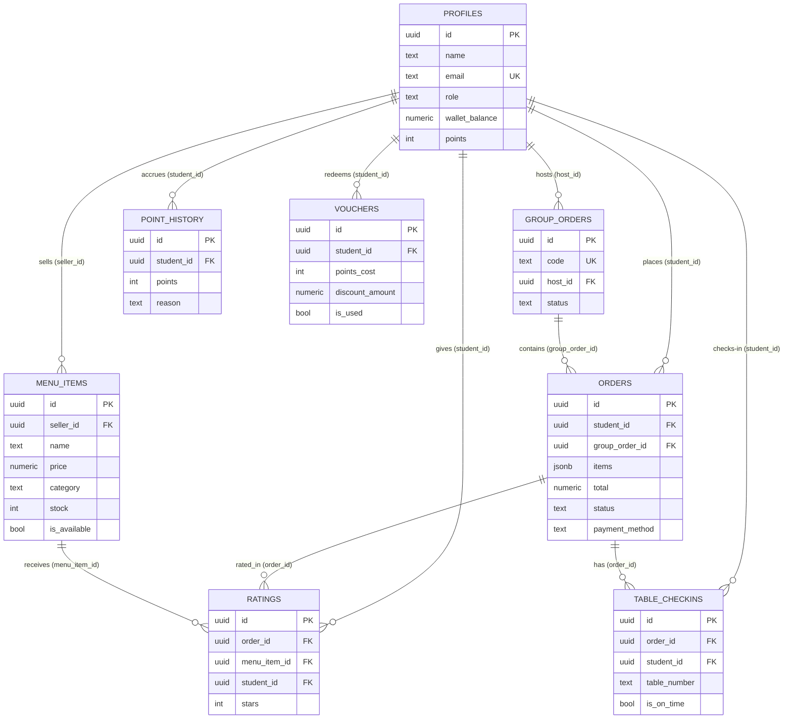

# Database Design

Document Version: v1.0

Project: DigiCanteen

Status: As-Built (Supabase / PostgreSQL)

Last Updated: 2026-07-16

Source: Diringkas ulang dari `data_model.md` (SoT-2) menjadi dokumen Database Design tersendiri sesuai format submission, ditambah skrip DDL siap-jalan di `backend/database/schema.sql`.

---

## 1. Ringkasan

DigiCanteen menggunakan **PostgreSQL** yang disediakan oleh **Supabase** sebagai Backend-as-a-Service. Autentikasi memakai `auth.users` bawaan Supabase Auth, dihubungkan 1:1 ke tabel `profiles` sebagai perluasan data pengguna aplikasi. Seluruh 8 tabel aplikasi dan relasinya dijabarkan di bawah; DDL lengkap tersedia di `backend/database/schema.sql`.

## 2. Entity Relationship Diagram (ERD)

## 3. Kamus Tabel (Data Dictionary)

### 3.1 `profiles`
| Kolom | Tipe | Constraint | Keterangan |
| --- | --- | --- | --- |
| id | UUID | PK, FK → auth.users.id | Sama dengan ID Supabase Auth |
| name | TEXT | NOT NULL | Nama tampilan |
| email | TEXT | UNIQUE, NOT NULL | Email login |
| role | TEXT | NOT NULL, CHECK IN ('siswa','penjual') | Peran pengguna |
| wallet_balance | NUMERIC(12,2) | NOT NULL, DEFAULT 0 | Saldo dompet internal |
| points | INT | NOT NULL, DEFAULT 0 | Akumulasi poin |
| created_at | TIMESTAMPTZ | DEFAULT NOW() | Waktu registrasi |

### 3.2 `menu_items`
| Kolom | Tipe | Constraint | Keterangan |
| --- | --- | --- | --- |
| id | UUID | PK | ID menu |
| seller_id | UUID | FK → profiles.id | Pemilik menu |
| name, description | TEXT | NOT NULL | Info dasar |
| price | NUMERIC(12,2) | CHECK ≥ 0 | Harga jual |
| discount_price | NUMERIC(12,2) | NULLABLE | Harga diskon opsional |
| image_url | TEXT | NOT NULL | Path Supabase Storage |
| category | TEXT | CHECK IN ('breakfast','lunch','snacks','drinks') | Kategori |
| badges | TEXT[] | DEFAULT '{}' | mis. best-seller |
| calories/protein/fat | INT | protein & fat nullable | Info gizi |
| ingredients | TEXT[] | DEFAULT '{}' | Daftar bahan |
| custom_options | JSONB | DEFAULT '[]' | `{id,label,extraPrice}[]` |
| is_available | BOOLEAN | DEFAULT true | Status jual |
| stock | INT | CHECK ≥ 0 | Sisa stok |

### 3.3 `orders`
| Kolom | Tipe | Constraint | Keterangan |
| --- | --- | --- | --- |
| id | UUID | PK | ID pesanan |
| student_id | UUID | FK → profiles.id | Pemesan |
| group_order_id | UUID | FK → group_orders.id, NULLABLE | Sesi Group Order terkait |
| items | JSONB | NOT NULL | Snapshot item pesanan |
| subtotal, service_fee, discount, total | NUMERIC(12,2) | NOT NULL (discount DEFAULT 0) | Rincian harga |
| pickup_time | TEXT | NOT NULL | Slot ambil |
| status | TEXT | CHECK 6 nilai (lihat state machine) | Status pesanan |
| payment_method | TEXT | CHECK IN ('qris','saldo') | Metode bayar |

### 3.4 `group_orders`
| Kolom | Tipe | Constraint | Keterangan |
| --- | --- | --- | --- |
| id | UUID | PK | — |
| code | TEXT | UNIQUE, NOT NULL | Kode 6 karakter |
| host_id | UUID | FK → profiles.id | Pembuat sesi |
| member_ids | UUID[] | DEFAULT '{}' | Anggota grup |
| status | TEXT | CHECK IN ('terbuka','terkunci','selesai') | Status sesi |

### 3.5 `table_checkins`
| Kolom | Tipe | Constraint | Keterangan |
| --- | --- | --- | --- |
| id | UUID | PK | — |
| order_id | UUID | FK → orders.id | Pesanan terkait |
| student_id | UUID | FK → profiles.id | Siswa |
| table_number | TEXT | NOT NULL | Nomor meja |
| check_in_at / check_out_at | TIMESTAMPTZ | check_out nullable | Waktu masuk/keluar |
| is_on_time | BOOLEAN | NULLABLE | Ketepatan waktu |
| points_earned | INT | NULLABLE | Poin didapat |

### 3.6 `ratings`
| Kolom | Tipe | Constraint | Keterangan |
| --- | --- | --- | --- |
| id | UUID | PK | — |
| order_id | UUID | FK → orders.id | — |
| menu_item_id | UUID | FK → menu_items.id | — |
| student_id | UUID | FK → profiles.id | — |
| stars | SMALLINT | CHECK 1–5 | Nilai bintang |
| comment | TEXT | NULLABLE | Komentar |
| — | — | UNIQUE (order_id, menu_item_id, student_id) | Cegah duplikasi, dukung upsert |

### 3.7 `point_history`
| Kolom | Tipe | Constraint | Keterangan |
| --- | --- | --- | --- |
| id | UUID | PK | — |
| student_id | UUID | FK → profiles.id | — |
| points | INT | NOT NULL | +/- poin |
| reason | TEXT | NOT NULL | Alasan mutasi |

### 3.8 `vouchers`
| Kolom | Tipe | Constraint | Keterangan |
| --- | --- | --- | --- |
| id | UUID | PK | — |
| student_id | UUID | FK → profiles.id | — |
| points_cost | INT | NOT NULL | Biaya poin ditukar |
| discount_amount | NUMERIC(12,2) | NOT NULL | Nilai potongan |
| is_used | BOOLEAN | DEFAULT false | Status pakai |

## 4. Normalisasi

Skema ini mengikuti **3NF**: setiap tabel non-`orders` menyimpan atribut yang bergantung penuh pada primary key-nya tanpa duplikasi. Pengecualian yang disengaja adalah kolom `orders.items` (JSONB) yang menyimpan snapshot denormalisasi item pesanan — dipilih agar riwayat pesanan tetap akurat meski data menu aslinya berubah/dihapus di kemudian hari, dengan trade-off tidak ada join otomatis ke `menu_items` untuk baris item pesanan lama.

## 5. Indexing Strategy

| Tabel | Index | Kolom | Tujuan |
| --- | --- | --- | --- |
| menu_items | idx_menu_seller | seller_id | Query menu per penjual |
| menu_items | idx_menu_category | category | Filter kategori |
| menu_items | idx_menu_badges (GIN) | badges | Query array badge |
| orders | idx_orders_student | student_id | Riwayat pesanan siswa |
| orders | idx_orders_status | status | Filter status (Pesanan Masuk, Dashboard) |
| orders | idx_orders_created_at | created_at | Urutan terbaru, grafik pendapatan |
| group_orders | idx_group_orders_code (UNIQUE) | code | Lookup saat join via kode |
| table_checkins | idx_checkins_student | student_id | Riwayat check-in |
| ratings | idx_ratings_menu_item | menu_item_id | Rata-rata rating per menu |
| ratings | uq_ratings_order_menu_student (UNIQUE) | order_id, menu_item_id, student_id | Cegah rating ganda |
| point_history | idx_points_student | student_id | Riwayat poin |
| vouchers | idx_vouchers_student | student_id | Daftar voucher siswa |

## 6. Keamanan Data

* **Row Level Security (RLS)** aktif di Supabase: penjual hanya dapat mengubah baris `menu_items` miliknya sendiri (`seller_id = auth.uid()`).
* Operasi lintas-peran yang sensitif (pemotongan stok, perubahan status pesanan dari sisi sistem) dijalankan lewat API route server (`backend/app/api/`) memakai `SUPABASE_SERVICE_ROLE_KEY`, bukan lewat client browser — kunci ini tidak pernah dikirim ke frontend.
* Autentikasi memakai Supabase Auth (email/password); kolom `role` di `profiles` tidak dapat diubah bebas dari sisi client.

## 7. Referensi

* Skrip siap jalan: `backend/database/schema.sql`
* Detail turunan dari kode data-layer aktual: `03-sot/data_model.md`
