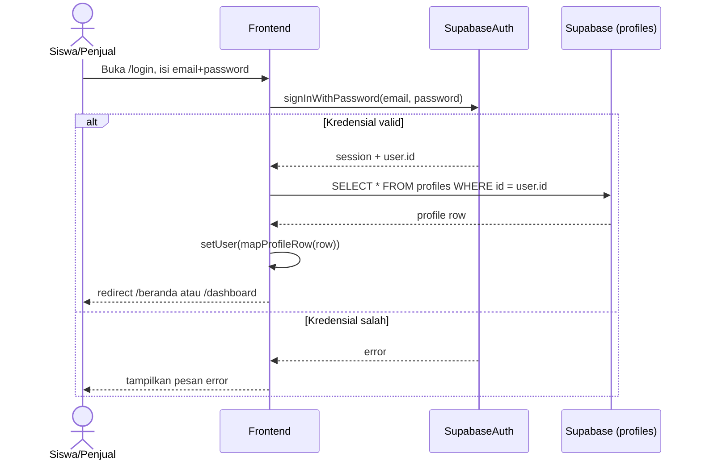
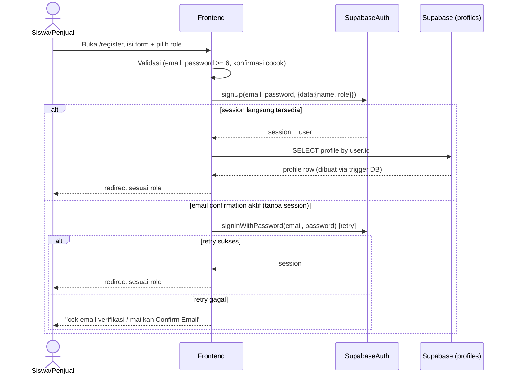
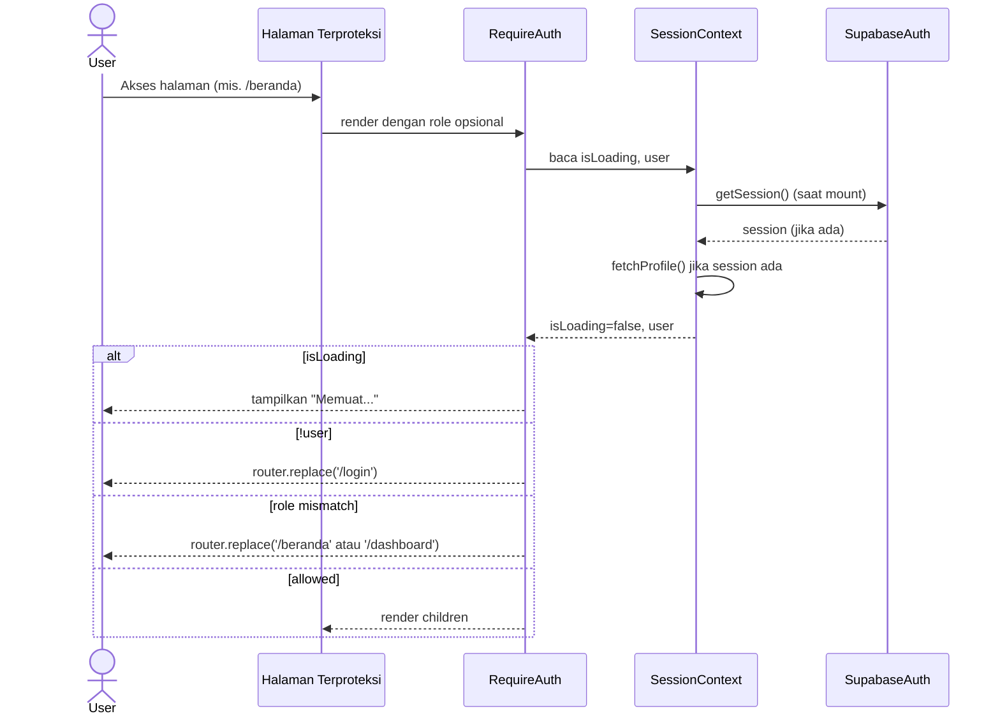

# System Logic: UC-001 Registrasi & Login

Document Version: v1.0

Use Case ID: UC-001

Use Case Name: Registrasi & Login

Status: Draft

Last Updated: 2026-07-11

Author: System Analyst

---

## 1. Overview

Dokumen ini mendefinisikan logika sistem untuk registrasi dan login memakai Supabase Auth, termasuk pembacaan profil dan penjagaan akses halaman (`RequireAuth`). Sumber: `lib/auth/session.tsx`, `lib/auth/RequireAuth.tsx`, `app/(auth)/login/page.tsx`, `app/(auth)/register/page.tsx`.

---

## 2. Sequence Diagram

### 2.1 Login



### 2.2 Register



### 2.3 Session Restore & Route Guard



---

## 3. Data Access Contract

### 3.1 `supabase.auth.signInWithPassword({ email, password })`

**Response sukses:** `{ data: { user, session }, error: null }`

**Response gagal:** `{ data: { user: null, session: null }, error: { message } }`

### 3.2 `supabase.auth.signUp({ email, password, options: { data: { name, role } } })`

**Catatan (terkonfirmasi dari komentar kode `app/(auth)/register/page.tsx`):** baris `profiles` dibuat otomatis lewat trigger database bernama **`handle_new_user()`** yang didefinisikan di `supabase_schema.sql`, dipicu begitu `auth.users` baru terbentuk, mengambil `name`/`role` dari `user_metadata` yang dikirim saat `signUp()`. Ini bukan lagi dugaan — disebutkan eksplisit di komentar kode, walau isi persis triggernya sendiri tidak ikut ter-upload.

### 3.3 `supabase.from('profiles').select('*').eq('id', userId).maybeSingle()`

**Mapping baris → `User`:**

```ts
{
  id: row.id,
  name: row.name,
  email: row.email,
  role: row.role,            // 'siswa' | 'penjual'
  walletBalance: row.wallet_balance,
  points: row.points,
}
```

### 3.4 `supabase.from('profiles').update({ name }).eq('id', user.id)`

Dipakai saat edit nama profil di `/profil` — optimistic update di client, rollback ke nama lama jika query gagal.

### 3.5 `supabase.auth.signOut()`

Dipanggil dari tombol "Logout" di NavDrawer/Profil; `setUser(null)` setelahnya.

---

## 4. Business Rules

| Rule | Description |
| --- | --- |
| BR-001 | Password minimal 6 karakter (validasi frontend, bukan constraint database) |
| BR-002 | Role tidak dapat diganti sendiri oleh pengguna setelah registrasi lewat form login |
| BR-003 | `RequireAuth` menunggu `isLoading` selesai sebelum memutuskan redirect, mencegah "kedip" ke halaman Login |
| BR-004 | Perubahan nama minimal 3 karakter (validasi di `updateName`) |

---

## 5. Traceability

| User Flow | Requirement | Data/API |
| --- | --- | --- |
| userflow_uc_001.md | F001 | `supabase.auth.*`, tabel `profiles` |
