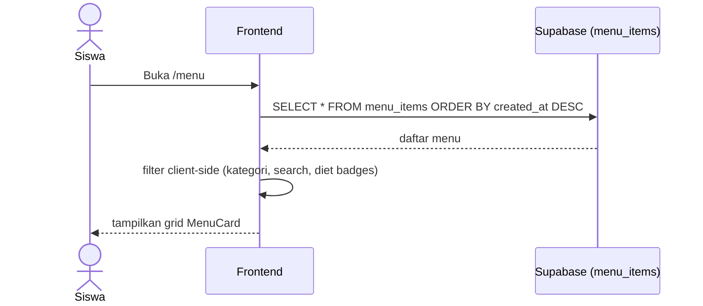
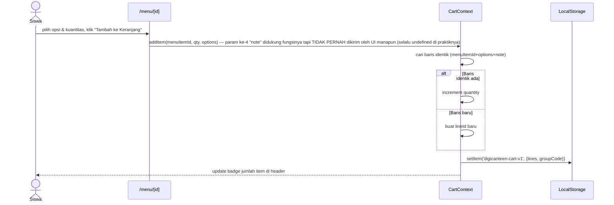
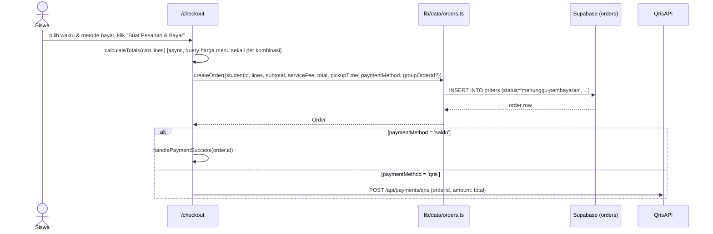
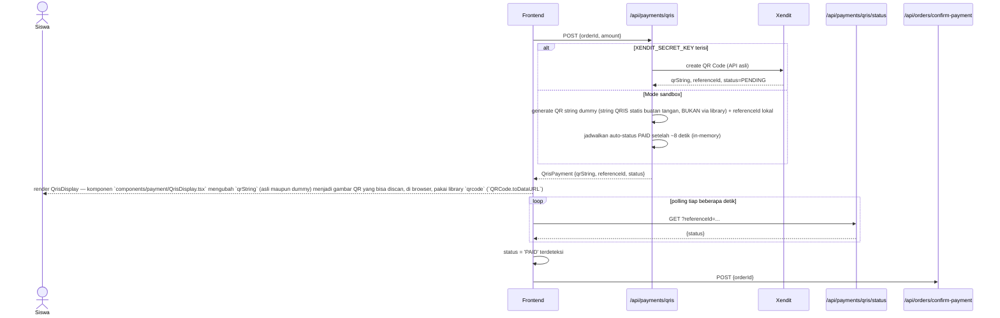
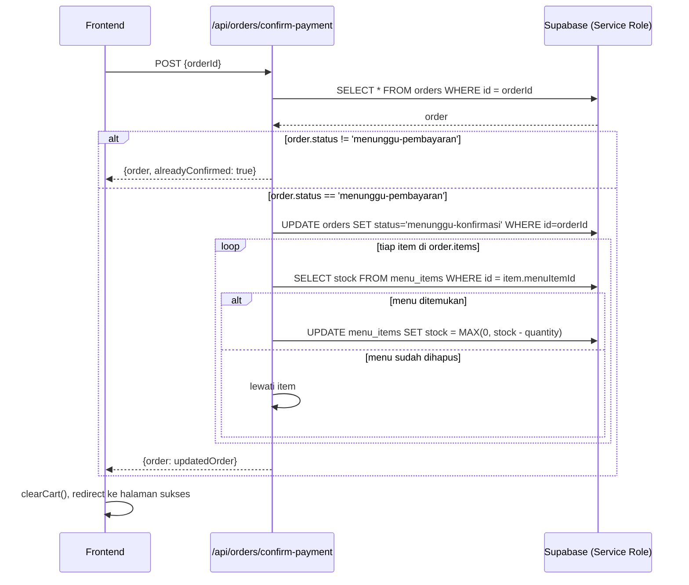

# System Logic: UC-002 Jelajah, Keranjang & Checkout (Pembayaran QRIS/Saldo)

Document Version: v1.0

Use Case ID: UC-002

Use Case Name: Jelajah, Keranjang & Checkout

Status: As-Built

Last Updated: 2026-07-11

Author: System Analyst AI

---

## 1. Overview

Dokumen ini mendefinisikan logika sistem untuk jelajah menu, kelola keranjang, pembuatan pesanan, dan pembayaran (QRIS via Xendit atau Saldo internal). Sumber: `lib/data/menu.ts`, `lib/data/orders.ts`, `lib/cart/CartContext.tsx`, `lib/cart/calculateTotals.ts`, `lib/payment/xendit.ts`, `app/api/payments/qris/*`, `app/api/orders/confirm-payment/route.ts`.

---

## 2. Sequence Diagram

### 2.1 Load & Filter Menu



### 2.2 Tambah ke Keranjang (client-only, localStorage)



### 2.3 Checkout & Buat Pesanan



### 2.4 Pembayaran QRIS (Xendit / Sandbox)



### 2.5 Konfirmasi Pembayaran & Potong Stok (Service Role, Idempoten)



---

## 3. API Contract

### 3.1 `getAllMenuItems()` / `getMenuItemsByCategory(category)` / `getBestSellers()`

Query langsung ke `menu_items` (lihat `lib/data/menu.ts`). Tidak melalui REST custom.

### 3.2 POST `/api/payments/qris`

**Request Body:**

```json
{ "orderId": "uuid", "amount": 45000 }
```

**Success Response (200 OK):**

```json
{
  "orderId": "uuid",
  "xenditReferenceId": "ref-xxxx",
  "qrString": "00020101021226...",
  "amount": 45000,
  "status": "PENDING",
  "expiresAt": "2026-07-11T10:15:00Z"
}
```

**Error Response (400):**

```json
{ "error": "orderId dan amount (angka positif) wajib diisi." }
```

### 3.3 GET `/api/payments/qris/status?referenceId=`

**Success Response (200 OK):**

```json
{ "status": "PAID" }
```

Nilai `status`: `PENDING` | `PAID` | `EXPIRED` | `FAILED`.

### 3.4 POST `/api/orders/confirm-payment`

**Request Body:**

```json
{ "orderId": "uuid" }
```

**Success Response (200 OK) — pertama kali:**

```json
{ "order": { "id": "uuid", "status": "menunggu-konfirmasi", "...": "..." } }
```

**Success Response (200 OK) — pemanggilan berulang (idempoten):**

```json
{ "order": { "...": "..." }, "alreadyConfirmed": true }
```

**Error Response (404):**

```json
{ "error": "Pesanan tidak ditemukan." }
```

**Error Response (500) — Service Role belum dikonfigurasi:**

```json
{ "error": "SUPABASE_SERVICE_ROLE_KEY belum diisi di .env.local. Lihat SETUP_SUPABASE_XENDIT.md." }
```

---

## 4. Business Rules

| Rule | Description |
| --- | --- |
| BR-001 | `SERVICE_FEE` flat Rp2.000 ditambahkan ke setiap pesanan |
| BR-002 | Total = subtotal + serviceFee − discount |
| BR-003 | Metode Saldo hanya diizinkan jika `walletBalance >= total` |
| BR-004 | Stok dikurangi minimal 0 (tidak boleh minus) |
| BR-005 | Endpoint confirm-payment idempoten berdasarkan pengecekan `order.status` |
| BR-006 | ID menu harus lolos validasi format UUID sebelum query (`isValidUuid`) |

---

## 5. Traceability

| User Flow | Requirement | Data/API |
| --- | --- | --- |
| userflow_uc_002.md | F002, F003, F004 | `menu_items`, `orders`, `/api/payments/qris*`, `/api/orders/confirm-payment` |
