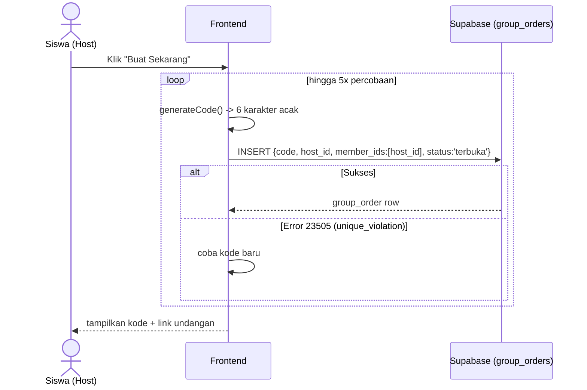
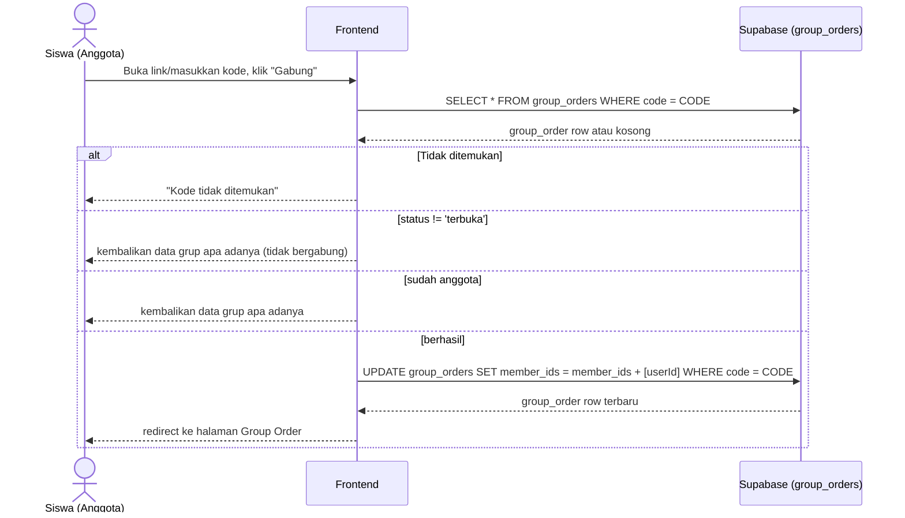
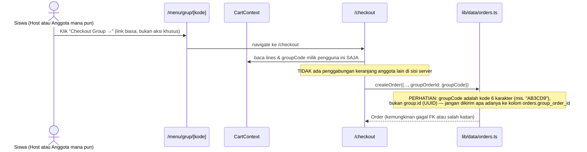

# System Logic: UC-003 Group Order

Document Version: v1.0

Use Case ID: UC-003

Use Case Name: Group Order

Status: Draft

Last Updated: 2026-07-11

Author: System Analyst

---

## 1. Overview

Dokumen ini mendefinisikan logika sistem pembuatan, penggabungan, dan penguncian sesi Group Order. Sumber: `lib/data/groups.ts`.

---

## 2. Sequence Diagram

### 2.1 Buat Group Order

### 2.2 Gabung Group Order

### 2.3 "Checkout Bareng" (Per-Anggota, Bukan Digabung)

**Catatan penting:** setiap anggota yang checkout membuat pesanan (`orders`) miliknya sendiri secara independen dari keranjangnya sendiri. Tidak ada satu pesanan gabungan untuk seluruh anggota grup.

---

## 3. Data Access Contract

### 3.1 `createGroupOrder(hostId): Promise<GroupOrder>`

INSERT ke `group_orders` dengan retry hingga 5x saat terjadi `unique_violation` (Postgres error code `23505`) pada kolom `code`.

### 3.2 `getGroupOrder(code): Promise<GroupOrder | undefined>`

`SELECT * FROM group_orders WHERE code = code.toUpperCase()` (single).

### 3.3 `joinGroupOrder(code, userId): Promise<GroupOrder | undefined>`

Membaca grup terlebih dahulu; hanya UPDATE `member_ids` jika `status === 'terbuka'` dan `userId` belum ada di daftar.

### 3.4 `leaveGroupOrder(code, userId): Promise<GroupOrder | undefined>`

UPDATE `member_ids` dengan memfilter keluar `userId`.

### 3.5 `lockGroupOrder(code): Promise<GroupOrder | undefined>`

UPDATE `status = 'terkunci'`. **Fungsi ini terverifikasi ada dan berfungsi di data layer, tetapi tidak dipanggil dari komponen UI manapun** (dicek lewat pencarian penuh ke seluruh kode frontend) — jadi grup di aplikasi berjalan saat ini tidak pernah benar-benar berubah ke status `terkunci` lewat interaksi pengguna biasa.

---

## 4. Business Rules

| Rule | Description |
| --- | --- |
| BR-001 | Kode 6 karakter dari alfabet terbatas (tanpa 0/O, 1/I) untuk mengurangi kesalahan baca manusia |
| BR-002 | Maksimal 5 percobaan generate kode sebelum dianggap gagal |
| BR-003 | Join hanya berhasil jika status grup `terbuka` |
| BR-004 | Join bersifat idempoten (anggota yang sudah ada tidak diduplikasi) |

---

## 5. Traceability

| User Flow | Requirement | Data/API |
| --- | --- | --- |
| userflow_uc_003.md | F005 | tabel `group_orders` |
