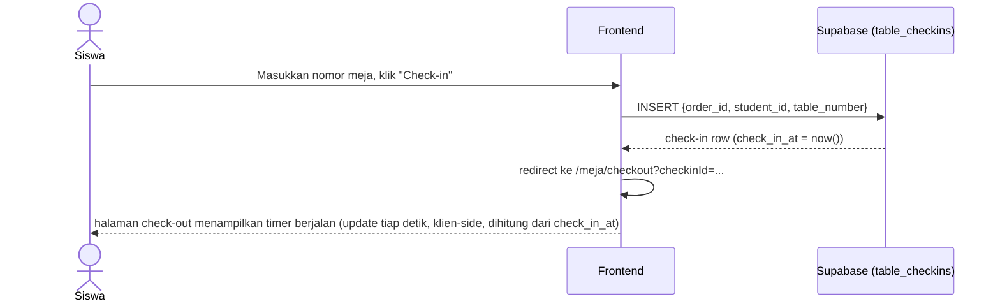
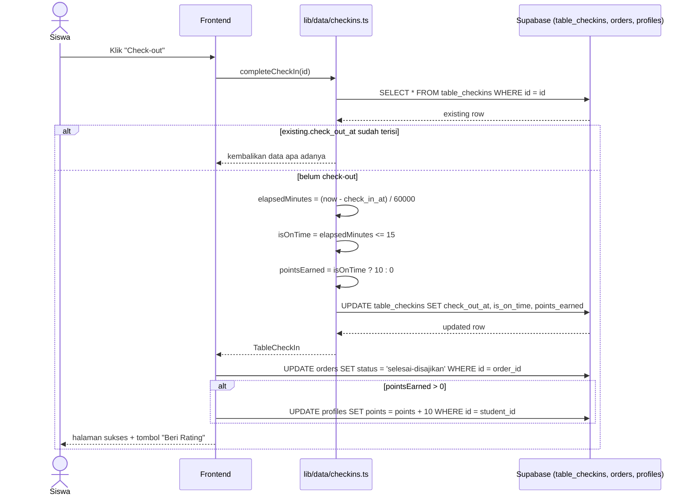
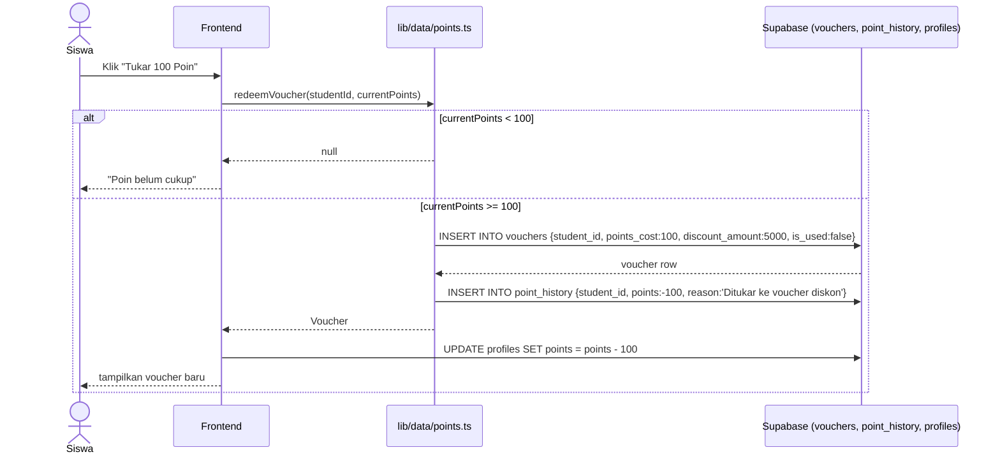

# System Logic: UC-004 Check-in/Check-out Meja & Poin

Document Version: v1.0

Use Case ID: UC-004

Use Case Name: Check-in/Check-out Meja & Poin

Status: Draft

Last Updated: 2026-07-11

Author: System Analyst

---

## 1. Overview

Dokumen ini mendefinisikan logika sistem untuk sesi check-in/check-out meja beserta perhitungan dan penukaran poin. 

---

## 2. Sequence Diagram

### 2.1 Check-in



### 2.2 Check-out & Kalkulasi Poin



### 2.3 Tukar Poin ke Voucher



---

## 3. Data Access Contract

### 3.1 `createCheckIn(orderId, studentId, tableNumber): Promise<TableCheckIn>`

INSERT `table_checkins`; `check_in_at` diisi otomatis oleh `DEFAULT NOW()`.

### 3.2 `completeCheckIn(id): Promise<TableCheckIn | undefined>`

Idempoten: jika `checkOutAt` sudah terisi, mengembalikan data tanpa perubahan lagi.

Formula:

```ts
elapsedMinutes = (checkOutAt.getTime() - checkInAt.getTime()) / 60000
isOnTime = elapsedMinutes <= BUSINESS_RULES.CHECKOUT_TIME_LIMIT_MINUTES // 15
pointsEarned = isOnTime ? BUSINESS_RULES.POINTS_PER_ON_TIME_CHECKOUT : 0 // 10 : 0
```

### 3.3 `addPointEntry(studentId, points, reason): Promise<PointHistoryEntry>`

INSERT `point_history`. Nilai `points` positif untuk didapat, negatif untuk ditukar.

### 3.4 `redeemVoucher(studentId, currentPoints): Promise<Voucher | null>`

Menolak (`return null`) jika `currentPoints < BUSINESS_RULES.POINTS_TO_VOUCHER_RATIO` (100). Jika lolos: INSERT `vouchers`, lalu panggil `addPointEntry` dengan nilai negatif.

**Catatan implementasi:** pemanggil (halaman `/poin`) tetap bertanggung jawab mengurangi `profiles.points` di sesi lewat `addPoints(-100)` — `redeemVoucher` sendiri tidak mengubah tabel `profiles`.

---

## 4. Business Rules

| Rule | Description |
| --- | --- |
| BR-001 | `CHECKOUT_TIME_LIMIT_MINUTES = 15` |
| BR-002 | `POINTS_PER_ON_TIME_CHECKOUT = 10` |
| BR-003 | `POINTS_TO_VOUCHER_RATIO = 100` |
| BR-004 | `VOUCHER_DISCOUNT_AMOUNT = 5000` |
| BR-005 | Check-out kedua kali untuk sesi yang sama tidak menghitung ulang poin |

---

## 5. Traceability

| User Flow | Requirement | Data/API |
| --- | --- | --- |
| userflow_uc_004.md | F006, F007 | `table_checkins`, `point_history`, `vouchers`, `profiles` |
