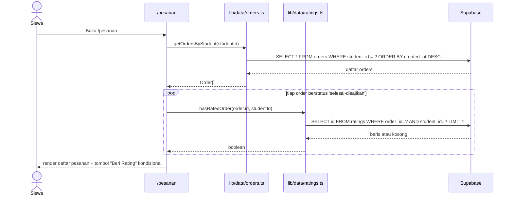
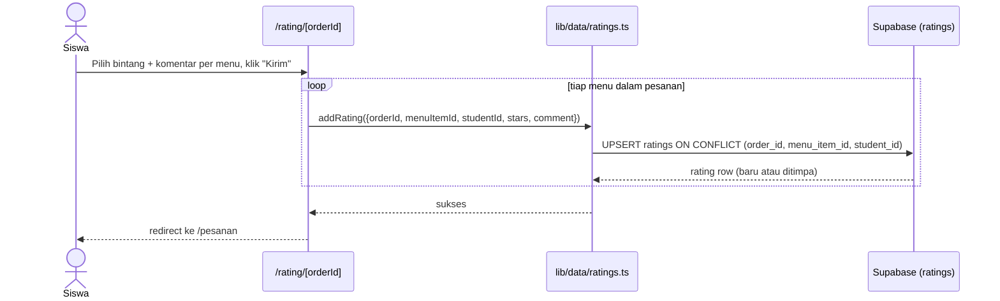
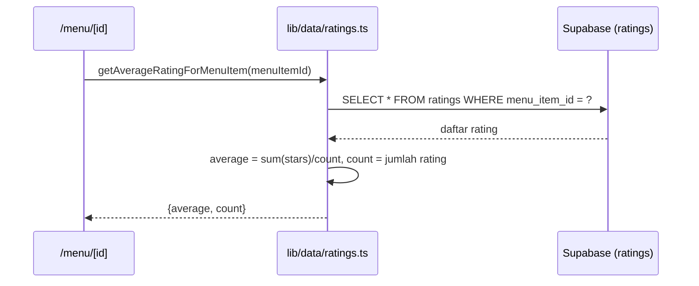

# System Logic: UC-005 Rating Makanan & Riwayat Pesanan

Document Version: v1.0

Use Case ID: UC-005

Use Case Name: Rating Makanan & Riwayat Pesanan

Status: As-Built

Last Updated: 2026-07-11

Author: System Analyst AI

---

## 1. Overview

Dokumen ini mendefinisikan logika sistem untuk riwayat pesanan siswa dan pemberian rating menu. Sumber: `lib/data/ratings.ts`, `lib/data/orders.ts`.

---

## 2. Sequence Diagram

### 2.1 Muat Riwayat Pesanan + Deteksi Kelayakan Rating



### 2.2 Kirim Rating (Upsert)



### 2.3 Hitung Rata-rata Rating Menu



---

## 3. Data Access Contract

### 3.1 `addRating(params): Promise<Rating>`

```ts
supabase.from('ratings').upsert(
  { order_id, menu_item_id, student_id, stars, comment },
  { onConflict: 'order_id,menu_item_id,student_id' }
).select().single();
```

### 3.2 `getRatingsForOrder(orderId)` / `getRatingsForMenuItem(menuItemId)`

Query `SELECT * FROM ratings WHERE order_id = ?` / `WHERE menu_item_id = ?`.

### 3.3 `getAverageRatingForMenuItem(menuItemId): Promise<{average, count}>`

Dihitung di aplikasi (bukan agregasi SQL) dari hasil `getRatingsForMenuItem`. Jika `ratings.length === 0`, mengembalikan `{ average: 0, count: 0 }`.

### 3.4 `hasRatedOrder(orderId, studentId): Promise<boolean>`

```ts
supabase.from('ratings').select('id').eq('order_id', orderId).eq('student_id', studentId).limit(1);
```

Mengembalikan `true` jika hasil `.length > 0`.

### 3.5 `getOrdersByStudent(studentId): Promise<Order[]>`

`SELECT * FROM orders WHERE student_id = ? ORDER BY created_at DESC`.

---

## 4. Business Rules

| Rule | Description |
| --- | --- |
| BR-001 | Kunci unik `(order_id, menu_item_id, student_id)` di database menjamin `upsert` menimpa, bukan menduplikasi |
| BR-002 | `stars` harus antara 1–5 (constraint database) |
| BR-003 | Rating dianggap "lengkap" untuk sebuah pesanan berdasarkan pengecekan per-menu di sisi frontend, mengabaikan menu yang datanya sudah terhapus |

---

## 5. Traceability

| User Flow | Requirement | Data/API |
| --- | --- | --- |
| userflow_uc_005.md | F008, F009 | tabel `ratings`, `orders` |
