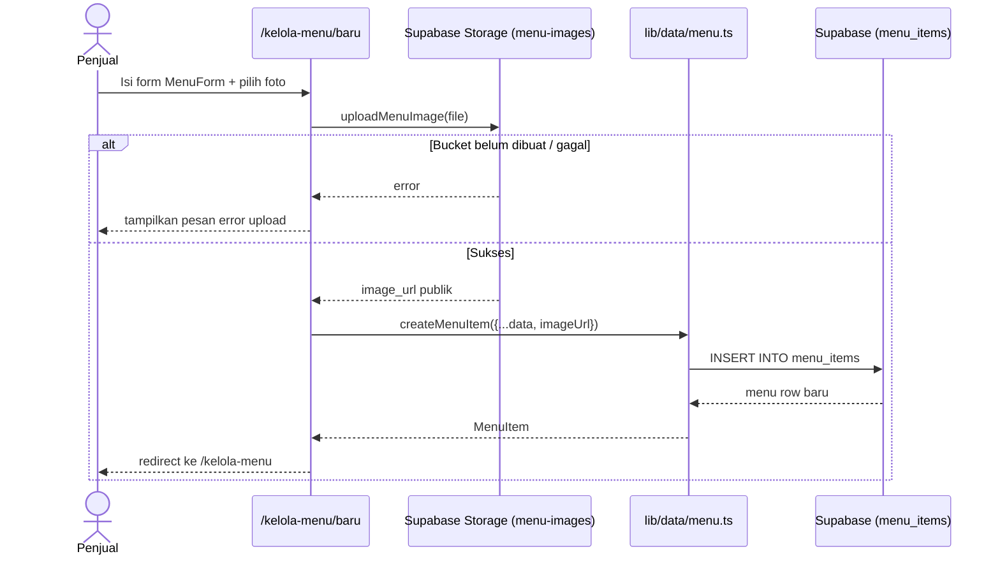
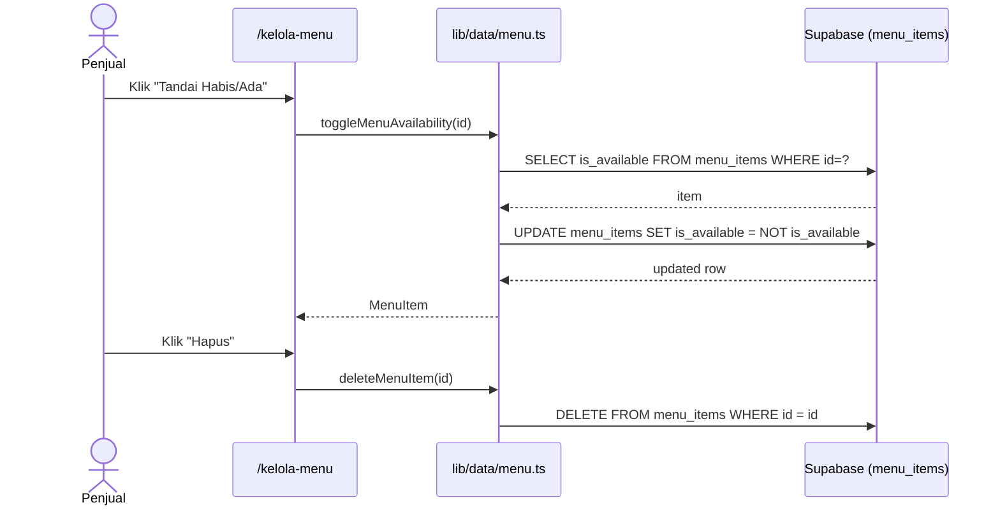
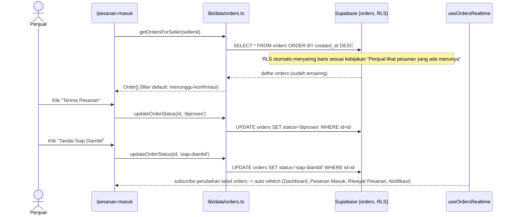
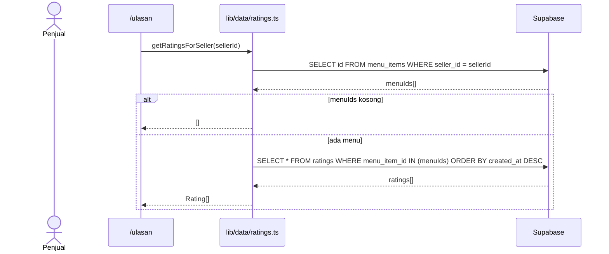
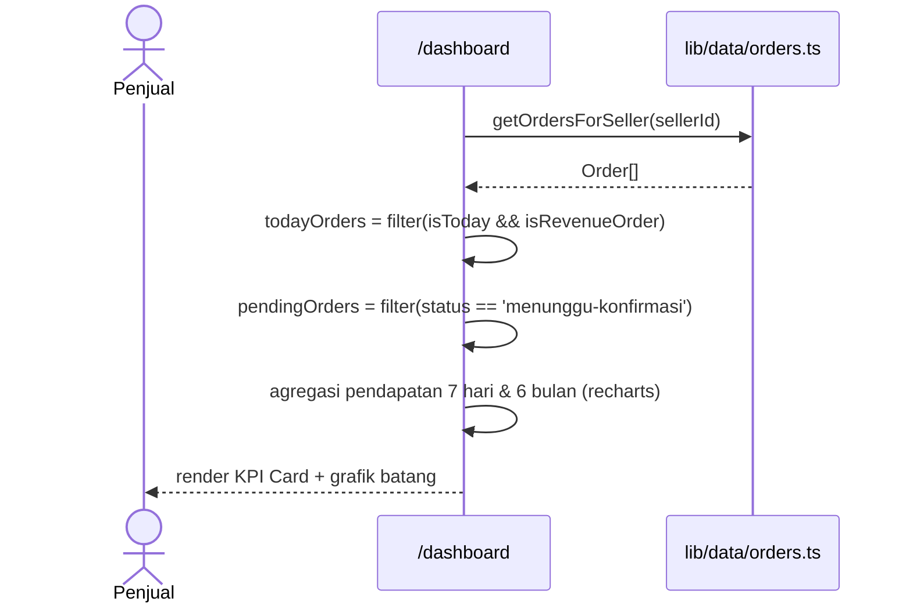

# System Logic: UC-006 Kelola Menu, Pesanan Masuk & Ulasan (Penjual)

Document Version: v1.0

Use Case ID: UC-006

Use Case Name: Kelola Menu, Pesanan Masuk & Ulasan

Status: As-Built

Last Updated: 2026-07-11

Author: System Analyst AI

---

## 1. Overview

Dokumen ini mendefinisikan logika sistem untuk operasional penjual: dashboard, CRUD menu, pemrosesan pesanan masuk, dan tinjauan ulasan. Sumber: `lib/data/menu.ts`, `lib/data/orders.ts`, `lib/data/ratings.ts`, `lib/supabase/uploadMenuImage.ts`, `lib/realtime/useOrdersRealtime.ts`.

---

## 2. Sequence Diagram

### 2.1 Tambah Menu Baru (dengan Upload Foto)



### 2.2 Toggle Ketersediaan & Hapus Menu



### 2.3 Proses Pesanan Masuk



### 2.4 Ambil Ulasan Penjual (Query 2 Langkah)



### 2.5 Dashboard KPI & Grafik Pendapatan



---

## 3. Data Access Contract

### 3.1 `getMenuItemsBySeller(sellerId)` / `createMenuItem(data)` / `updateMenuItem(id, updates)` / `deleteMenuItem(id)` / `toggleMenuAvailability(id)`

Lihat `lib/data/menu.ts` — semua operasi CRUD standar terhadap tabel `menu_items`, kolom di-mapping `camelCase ↔ snake_case`.

### 3.2 `getOrdersForSeller(sellerId): Promise<Order[]>`

```ts
supabase.from('orders').select('*').order('created_at', { ascending: false });
```

**Catatan penting:** query ini sengaja "select semua" — baris yang benar-benar dikembalikan sudah disaring RLS berdasarkan kebijakan "Penjual lihat pesanan yang ada menunya", sehingga penjual A tidak pernah menerima baris milik penjual B walau parameter `sellerId` tidak dipakai langsung dalam query.

### 3.3 `updateOrderStatus(id, status): Promise<Order | undefined>`

```ts
supabase.from('orders').update({ status }).eq('id', id).select().maybeSingle();
```

### 3.4 `getRatingsForSeller(sellerId): Promise<Rating[]>`

Query dua langkah karena tabel `ratings` tidak memiliki kolom `seller_id` langsung (lihat sequence diagram 2.4).

### 3.5 `uploadMenuImage(file): Promise<string>`

Upload ke bucket Supabase Storage `menu-images`, mengembalikan URL publik. Bucket harus dibuat manual lewat dashboard Supabase (tidak bisa lewat SQL biasa).

---

## 4. Business Rules

| Rule | Description |
| --- | --- |
| BR-001 | Pemisahan data antar-penjual ditegakkan oleh RLS di database, bukan filter di kode aplikasi |
| BR-002 | Grafik pendapatan hanya menghitung pesanan dengan status bukan `menunggu-pembayaran` dan bukan `dibatalkan` |
| BR-003 | Filter default halaman Pesanan Masuk: status `menunggu-konfirmasi` ("Perlu Diterima") |
| BR-004 | Operasi lintas-peran sensitif (potong stok saat konfirmasi bayar) TIDAK dilakukan di alur ini — didelegasikan ke endpoint Service Role terpisah (lihat sys_uc_002.md Bagian 2.5) karena RLS sengaja tidak mengizinkan siswa mengubah data milik penjual secara langsung |

---

## 5. Traceability

| User Flow | Requirement | Data/API |
| --- | --- | --- |
| userflow_uc_006.md | F010, F011, F012, F013 | `menu_items`, `orders`, `ratings`, Supabase Storage `menu-images` |
